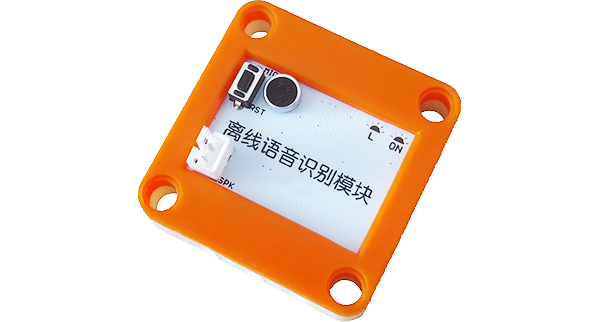

# YFROBOT 离线语音识别模块

## 简介 Introduction

本扩展库为Mind+软件设计。

支持 YFROBOT 离线语音识别模块。

## 相关链接 Links
* 本项目加载链接: https://github.com/YFROBOT-TM

* 产品购买链接: [YFROBOT商城](https://www.yfrobot.com/)、[YFROBOT淘宝商城](https://yfrobot.taobao.com/).

## 积木列表 Blocks

## 示例程序 Examples

## 许可证 License
MIT

## 硬件支持列表 Hardware Support
主板型号                | 实时模式    | ArduinoC   | MicroPython    | 备注
------------------ | :----------: | :----------: | :---------: | -----
arduino uno        |             |       √已测试       |             | 

## 更新日志 Release Note
- V0.0.2  升级优化通信算法，Mind+V1.7.3 RC1.0版本软件测试
- V0.0.1  基础功能完成，Mind+V1.7.1 RC3.0版本软件测试

## 联系我们 Contact Us
* http://www.yfrobot.com.cn/wiki/index.php?title=%E8%81%94%E7%B3%BB%E6%88%91%E4%BB%AC

## 参考 Reference Resources
* https://github.com/adafruit/RTClib
